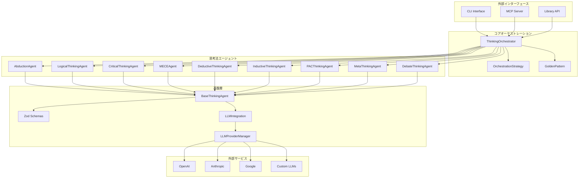

# Conflux アーキテクチャ設計書

## 概要

Confluxは、9つの構造化された思考法を組み合わせたマルチエージェントシステムで、開発の各局面に最適な意思決定と分析を支援するTypeScriptライブラリです。Model Context Protocol (MCP)準拠で、AI開発環境との統合を実現しています。

## アーキテクチャ全体図



## コアコンポーネント

### 1. ThinkingOrchestrator（思考オーケストレーター）

**責務**: マルチエージェント思考プロセスの統合管理

**主要機能**:
- 局面別思考戦略の実行（`processPhase`）
- 黄金パターンの実行（`processGoldenPattern`）
- 単一思考法の実行（`processSingleMethod`）
- エージェント間の連携管理
- 思考プロセスの統合と最適化

**実装詳細**:
```typescript
class ThinkingOrchestrator {
  private agents: Map<ThinkingMethodType, IThinkingAgent> = new Map();
  
  // 局面別戦略マッピング
  private PHASE_THINKING_MAP: Record<DevelopmentPhase, OrchestrationStrategy>
  
  // 黄金パターンシーケンス
  private GOLDEN_PATTERN_SEQUENCE: ThinkingMethodType[]
}
```

### 2. BaseThinkingAgent（ベースエージェント）

**責務**: 全思考法エージェントの共通基盤

**設計原則**:
- Template Methodパターンによる標準フロー定義
- 入力検証、前処理、LLM実行、後処理の一貫した流れ
- 自動復旧機能付きLLM呼び出し
- エラーハンドリングと失敗時の適切な処理

**実装パターン**:
```typescript
abstract class BaseThinkingAgent implements IThinkingAgent {
  // Template Method: 標準思考プロセス
  async think(input: unknown, context: AgentContext): Promise<ThinkingResult>
  
  // サブクラスで実装必須
  protected abstract executeLLMThinking(input: unknown, context: AgentContext): Promise<Record<string, unknown>>
  
  // 自動復旧機能付きLLM呼び出し
  protected async callLLMWithAutoRecovery<T>(...)
}
```

### 3. LLMProviderManager（LLMプロバイダーマネージャー）

**責務**: 複数LLMプロバイダーの統一管理

**対応プロバイダー**:
- OpenAI (GPT-5, GPT-4o, etc.)
- Anthropic (Claude Sonnet 4, Claude 3.5)
- Google (Gemini 2.0, Gemini 1.5)
- OpenAI互換カスタムエンドポイント
- モックプロバイダー（テスト用）

**主要機能**:
- プロバイダー登録・管理
- フォールバック機能
- レート制限対応
- 環境変数ベースの自動設定

### 4. LLMIntegration（LLM統合）

**責務**: 思考法エージェント向けの高度なLLM操作

**主要機能**:
- 構造化出力生成（`generateStructuredOutput`）
- 自動復旧機能（スキーマ不一致時の自動修正）
- 複数プロバイダーでのフォールバック
- 指数バックオフによる再試行
- プロバイダー健康チェック

## 思考法エージェント詳細

### 1. アブダクションエージェント（AbductionAgent）

**用途**: 驚きの事実から説明仮説を形成

**適用局面**: 事業探索、デバッグ、実験、仮説分解

**入力スキーマ**:
```typescript
AbductionInput = {
  surprisingFact: string;    // 驚くべき事実
  context?: string;          // コンテキスト情報
  domain?: string;          // 対象ドメイン
}
```

**出力スキーマ**:
```typescript
AbductionOutput = {
  hypotheses: Array<{
    explanation: string;
    plausibility: number;
    testablePredictions: string[];
  }>;
  recommendedNext: ThinkingMethodType[];
}
```

### 2. ロジカルシンキングエージェント（LogicalThinkingAgent）

**用途**: 論点から結論への論理的道筋を構築

**適用局面**: 要件定義、優先順位付け、見積もり・計画、ふりかえり

**特徴**: ピラミッド構造での論理整理

### 3. クリティカルシンキングエージェント（CriticalThinkingAgent）

**用途**: 前提・論点・根拠を体系的に疑う

**適用局面**: リファクタリング、コードレビュー、要件定義、価値仮説

**特徴**: バイアス検出、論理の飛躍特定

### 4. MECEエージェント（MECEAgent）

**用途**: 項目を漏れなく重複なく分類

**適用局面**: 優先順位付け、リファクタリング、コードレビュー、テスト設計

**特徴**: 完全性と排他性の保証

### 5. 演繹的思考エージェント（DeductiveThinkingAgent）

**用途**: 一般的な原則・理論から具体的な結論を導出

**適用局面**: アーキ設計、実装、デバッグ、テスト設計

**特徴**: 三段論法による論理的推論

### 6. 帰納的思考エージェント（InductiveThinkingAgent）

**用途**: 個別事例から共通パターンを発見

**適用局面**: 価値仮説、実験、デバッグ

**特徴**: 統計的推論、一般化の導出

### 7. PAC思考エージェント（PACThinkingAgent）

**用途**: 前提・仮定・結論に分解して検証

**適用局面**: 仮説分解、ふりかえり

**特徴**: 仮説の構造化分析

### 8. メタ思考エージェント（MetaThinkingAgent）

**用途**: 思考プロセス自体を評価・改善

**適用局面**: ふりかえり、見積もり・計画、意思決定

**特徴**: 高次思考プロセスの分析

### 9. ディベート思考エージェント（DebateThinkingAgent）

**用途**: 賛成・反対論点で意思決定支援

**適用局面**: 意思決定、アーキ設計

**特徴**: 対立構造での多角的検討

## 局面別思考戦略

### 戦略マッピング

| 局面 | 主要思考法 | 併用思考法 | 目的 |
|------|------------|------------|------|
| business_exploration | abduction | inductive, deductive, meta | 驚きから仮説形成 |
| requirement_definition | logical | mece, critical | 論点→結論の道筋 |
| value_hypothesis | inductive | critical | データから一般化 |
| architecture_design | deductive | debate | 原則→設計結論 |
| prioritization | mece | logical | 粒度揃え・重複排除 |
| estimation_planning | logical | meta | 前提→分解→見積 |
| implementation | deductive | critical | 原則→具体コード |
| debugging | abduction | deductive, inductive | 兆候→原因仮説 |
| refactoring | critical | mece, logical | 前提・依存を疑う |
| code_review | critical | deductive, mece | 結論↔根拠の検証 |
| test_design | deductive | mece, inductive | 仕様→条件導出 |
| experimentation | inductive | critical | データ→効果一般化 |
| decision_making | debate | meta | 賛否論点の顕在化 |
| retrospective | meta | logical, pac | 思考プロセス見直し |
| hypothesis_breakdown | pac | critical | 前提・仮定・結論分解 |

### 黄金パターン（Golden Pattern）

**シーケンス**: abduction → deductive → inductive → critical → logical → meta → debate

**用途**: 探索から実装までの統合フロー

**特徴**: 各思考法の出力が次の思考法の入力となる連鎖構造

## 型安全性とスキーマ設計

### Zodスキーマ体系

```typescript
// 基本型定義
ThinkingMethodType = 'abduction' | 'logical' | 'critical' | 'mece' | 'deductive' | 'inductive' | 'pac' | 'meta' | 'debate'
DevelopmentPhase = 'business_exploration' | 'requirement_definition' | ... | 'hypothesis_breakdown'

// 思考結果
ThinkingResult = {
  method: ThinkingMethodType;
  status: 'pending' | 'in_progress' | 'completed' | 'failed';
  input: Record<string, unknown>;
  output?: Record<string, unknown>;
  confidence: number; // 0-1
  reasoning: string;
  nextRecommendations?: ThinkingMethodType[];
  metadata?: Record<string, unknown>;
}

// 統合思考結果
IntegratedThinkingResult = {
  phase: DevelopmentPhase;
  primaryMethod: ThinkingMethodType;
  secondaryMethods: ThinkingMethodType[];
  results: ThinkingResult[];
  synthesis: string;
  actionItems: string[];
  confidence: number;
  nextSteps: string[];
}
```

### 各思考法の入出力スキーマ

全ての思考法について、Zodスキーマによる厳密な型定義を実装：

- `AbductionInput` / `AbductionOutput`
- `LogicalInput` / `LogicalOutput`
- `CriticalInput` / `CriticalOutput`
- `MECEInput` / `MECEOutput`
- `DeductiveInput` / `DeductiveOutput`
- `InductiveInput` / `InductiveOutput`
- `PACInput` / `PACOutput`
- `MetaInput` / `MetaOutput`
- `DebateInput` / `DebateOutput`

## MCP統合

### MCPサーバー実装

**提供ツール**:
- `process-phase`: 局面別統合思考プロセス
- `process-golden-pattern`: 黄金パターン実行
- `process-single-method`: 単一思考法実行
- `list-thinking-methods`: 思考法一覧取得
- `get-phase-recommendations`: 局面別推奨取得

**統合例**:
```json
{
  "mcpServers": {
    "thinking-agents": {
      "command": "npx",
      "args": ["@53able/conflux", "server"],
      "env": {
        "OPENAI_API_KEY": "sk-proj-...",
        "DEFAULT_LLM_PROVIDER": "openai"
      }
    }
  }
}
```

## CLI設計

### Commander.jsベースのコマンド体系

```bash
# 局面別思考プロセス
conflux phase debugging '{"issue": "APIエラー", "context": "DB問題"}'

# 黄金パターン実行
conflux golden '{"problem": "アーキテクチャ設計"}'

# 単一思考法
conflux single critical '{"claim": "この実装で十分"}'

# 思考法一覧
conflux list

# 局面別推奨
conflux recommend debugging

# MCPサーバー起動
conflux server
```

## 品質保証

### TypeScript厳密モード

```json
{
  "compilerOptions": {
    "strict": true,
    "noImplicitAny": true,
    "exactOptionalPropertyTypes": true
  }
}
```

### ESLint設定

- any型完全禁止
- 未使用変数検出
- 一貫した命名規則

### テスト戦略

- 単体テスト（各エージェント）
- 統合テスト（オーケストレーター）
- E2Eテスト（CLI・MCP）

## 拡張性

### カスタムエージェント追加

```typescript
class CustomThinkingAgent extends BaseThinkingAgent {
  readonly capability: AgentCapability = {
    methodType: 'custom',
    description: 'カスタム思考法',
    applicablePhases: ['implementation'],
    requiredInputSchema: z.object({ /* スキーマ */ }),
    outputSchema: z.object({ /* 出力スキーマ */ }),
    combinationSynergies: ['critical', 'logical'],
  };
  
  protected async executeLLMThinking(input: unknown, context: AgentContext) {
    // カスタムロジック実装
  }
}
```

### 新規プロバイダー追加

```typescript
// カスタムLLMプロバイダーの追加
globalLLMManager.registerProvider('custom', {
  type: 'openai-compatible',
  baseURL: 'https://api.custom-llm.com/v1',
  model: 'custom-model',
  apiKey: 'custom-key',
});
```

## パフォーマンス特性

### 並列処理

- 独立した思考法は並列実行可能
- LLM呼び出しの最適化
- キャッシュ戦略

### エラーハンドリング

- 自動復旧機能
- フォールバックプロバイダー
- 指数バックオフ

### リソース管理

- プロバイダー選択最適化
- レート制限対応
- メモリ使用量最適化

## セキュリティ

### APIキー管理

- 環境変数ベースの設定
- プロバイダー固有の認証
- セキュアな設定管理

### データ処理

- 入力検証（Zod）
- 出力サニタイゼーション
- 機密情報の保護

## Docker環境でのアーキテクチャ

### コンテナ化戦略

Confluxは本番環境での使用に最適化されたDockerコンテナを提供します。

#### マルチステージビルド

```dockerfile
# ビルドステージ
FROM node:20-alpine AS builder
RUN npm install -g pnpm
WORKDIR /app
COPY package.json pnpm-lock.yaml ./
RUN pnpm install --frozen-lockfile
COPY . .
RUN pnpm run build

# 本番ステージ
FROM node:20-alpine AS production
RUN npm install -g pnpm
WORKDIR /app
COPY package.json pnpm-lock.yaml ./
RUN pnpm install --frozen-lockfile --prod
COPY --from=builder /app/dist ./dist
RUN addgroup -g 1001 -S nodejs && adduser -S conflux -u 1001
RUN chown -R conflux:nodejs /app
USER conflux
CMD ["node", "dist/mcp/server.js"]
```

#### セキュリティ設計

- **非rootユーザー実行**: `conflux`ユーザーでの実行
- **最小権限の原則**: 必要最小限の依存関係のみ
- **Alpine Linux**: 軽量でセキュアなベースイメージ
- **マルチステージビルド**: 本番イメージのサイズ最適化

#### Docker Compose設定

```yaml
version: '3.8'
services:
  mcp-server:
    build: 
      context: .
      target: production
    environment:
      - NODE_ENV=production
      - OPENAI_API_KEY=${OPENAI_API_KEY}
      - ANTHROPIC_API_KEY=${ANTHROPIC_API_KEY}
      - DEFAULT_LLM_PROVIDER=${DEFAULT_LLM_PROVIDER:-openai}
    stdin_open: true
    tty: true
    restart: unless-stopped
```

### デプロイメントパターン

#### 1. 単一コンテナデプロイメント

```bash
# 直接実行
docker run -it --rm \
  -e OPENAI_API_KEY=your_key \
  conflux-mcp

# バックグラウンド実行
docker run -d --name conflux-mcp \
  -e OPENAI_API_KEY=your_key \
  conflux-mcp
```

#### 2. Docker Composeデプロイメント

```bash
# 開発環境
docker compose --env-file .env.docker up --build

# 本番環境
docker compose -f docker-compose.yml -f docker-compose.prod.yml up -d
```

#### 3. Kubernetesデプロイメント

```yaml
apiVersion: apps/v1
kind: Deployment
metadata:
  name: conflux-mcp
spec:
  replicas: 1
  selector:
    matchLabels:
      app: conflux-mcp
  template:
    metadata:
      labels:
        app: conflux-mcp
    spec:
      containers:
      - name: conflux-mcp
        image: conflux-mcp:latest
        env:
        - name: OPENAI_API_KEY
          valueFrom:
            secretKeyRef:
              name: conflux-secrets
              key: openai-api-key
        stdin: true
        tty: true
```

### ログとモニタリング

#### Winstonログ設定

```typescript
const logger = createLogger({
  level: 'info',
  format: format.combine(
    format.timestamp(),
    format.errors({ stack: true }),
    format.json()
  ),
  transports: [
    new transports.Console(),
    new transports.File({ filename: 'mcp-server.log' })
  ]
});
```

#### ヘルスチェック

```yaml
healthcheck:
  test: ["CMD", "node", "-e", "process.exit(0)"]
  interval: 30s
  timeout: 10s
  retries: 3
```

### パフォーマンス最適化

#### リソース制限

```yaml
deploy:
  resources:
    limits:
      memory: 512M
      cpus: '0.5'
    reservations:
      memory: 256M
      cpus: '0.25'
```

#### キャッシュ戦略

- **Docker Layer Caching**: 依存関係のキャッシュ
- **pnpm Cache**: パッケージマネージャーのキャッシュ
- **Build Cache**: TypeScriptコンパイルのキャッシュ

## 今後の拡張方向

1. **新規思考法の追加**
2. **AIモデルの進化への対応**
3. **多言語サポート**
4. **可視化機能**
5. **学習機能の追加**
6. **Kubernetesネイティブサポート**
7. **マイクロサービス化**

---

このアーキテクチャは、構造化された思考プロセスを支援する堅牢で拡張可能なシステムを提供します。Docker環境での本番運用に最適化されており、スケーラブルでセキュアなデプロイメントを実現します。
