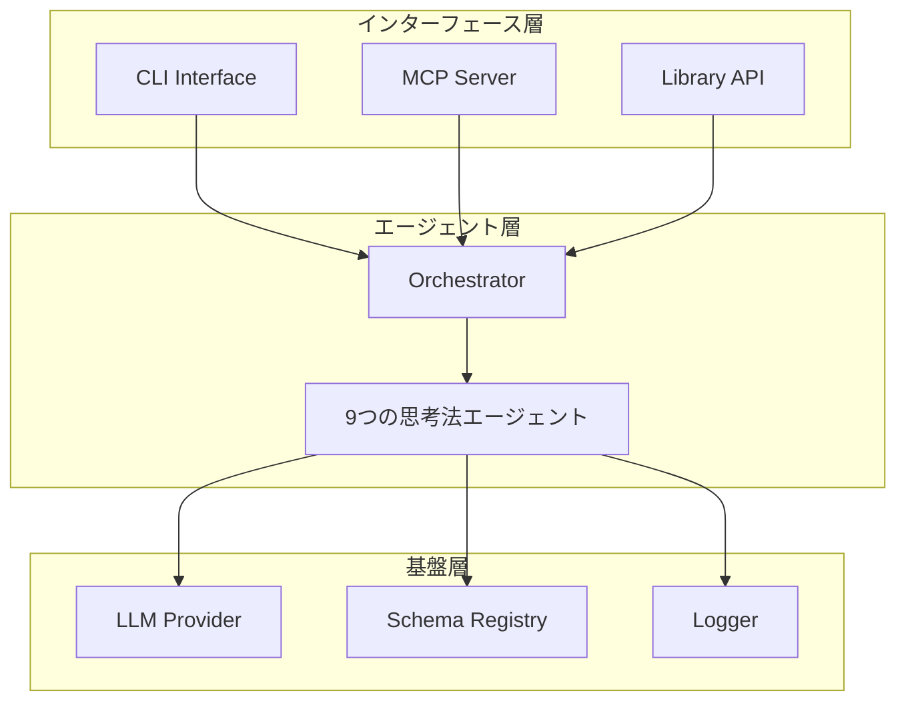

# Conflux アーキテクチャ設計書

## 目次

- [概要](#概要)
- [アーキテクチャ概要](#アーキテクチャ概要)
- [設計原則](#設計原則)
- [エージェント設計](#エージェント設計)
- [思考戦略](#思考戦略)
- [技術スタック](#技術スタック)
- [統合インターフェース](#統合インターフェース)
- [品質保証](#品質保証)
- [拡張性](#拡張性)

---

## 概要

Confluxは、9つの構造化された思考法を組み合わせたマルチエージェントシステムです。各エージェントが特定の思考パターンに特化し、開発プロセスの各局面で最適な思考支援を提供します。

**主な特徴**:
- **9つの思考法**: アブダクション、ロジカル、クリティカル、MECE、演繹、帰納、PAC、メタ、ディベート
- **局面別最適化**: 15の開発局面に応じた思考戦略
- **透明性**: 思考プロセスの完全な可視化
- **信頼性**: 一貫した結果と自動復旧機能
- **拡張性**: 新しい思考法の容易な追加

**パッケージ名**: @53able/conflux  
**リポジトリ**: https://github.com/53able/conflux

## 関連ドキュメント

- [MCP Server Setup](mcp-server-setup.md) - MCPサーバーのセットアップ方法
- [Docker使用方法](docker-usage.md) - Dockerでの実行方法
- [思考法の使い方](思考法の使い方.md) - 思考法の詳細説明

## アーキテクチャ概要

Confluxは関数型プログラミングの原則に基づいた3層のアーキテクチャで構成されています：



### エージェントの特徴

- **特化性**: 一つの思考法に集中し、その領域で最高の性能を発揮
- **独立性**: 他のエージェントに依存せず、単独で動作可能
- **一貫性**: 同じ入力に対して常に同じ形式の出力を生成
- **透明性**: 思考プロセスの各ステップを明確に記録

## 設計原則

Confluxは、Building effective agentsの原則に基づいて設計されています：

### 1. シンプルな設計
- 複雑さを排除し、本質的な機能に集中
- 各エージェントは単一の思考法に特化
- 必要最小限のパラメータで設定

### 2. 透明性
- エージェントの動作を完全に可視化
- 思考プロセスの各ステップを記録
- デバッグと学習を支援

### 3. 信頼性
- 一貫した結果と予測可能な動作を保証
- 自動復旧機能とエラーハンドリング
- 型安全性による堅牢性

### 4. 拡張性
- 新しい思考法の容易な追加
- 統一されたインターフェース
- プラグインアーキテクチャ

## エージェント設計

### 関数型エージェントアーキテクチャ

各エージェントは以下の標準インターフェースで動作します：

```typescript
interface FunctionalAgent<Input, Output> {
  readonly capability: AgentCapability;
  readonly config: AgentConfig;
  readonly generatePrompts: PromptGenerator<Input>;
  readonly calculateConfidence: ConfidenceCalculator<Output>;
  readonly generateReasoning: ReasoningGenerator<Input, Output>;
  readonly recommendNextSteps: NextStepRecommender;
}
```

### 9つの思考法エージェント

詳細な思考法の説明は [思考法の使い方](思考法の使い方.md) を参照してください。

1. **AbductionAgent** - 驚きの事実から説明仮説を形成
2. **LogicalAgent** - 論点から結論への論理的道筋を構築
3. **CriticalAgent** - 前提・論点・根拠を体系的に疑う
4. **MECEAgent** - 項目を漏れなく重複なく分類
5. **DeductiveAgent** - 一般的な原則から具体的な結論を導出
6. **InductiveAgent** - 個別事例から共通パターンを発見
7. **PACAgent** - 前提・仮定・結論に分解して検証
8. **MetaAgent** - 思考プロセス自体を評価・改善
9. **DebateAgent** - 賛成・反対論点で意思決定支援

## 思考戦略

### 局面別戦略マッピング

各開発局面に最適な思考法の組み合わせを定義：

| 局面 | 主要思考法 | 併用思考法 | 目的 |
|------|------------|------------|------|
| business_exploration | abduction | inductive, deductive, meta | 驚きから仮説形成 |
| requirement_definition | logical | mece, critical | 論点→結論の道筋 |
| value_hypothesis | inductive | critical | データから一般化 |
| architecture_design | deductive | debate | 原則→設計結論 |
| prioritization | mece | logical | 粒度揃え・重複排除 |
| debugging | abduction | deductive, inductive | 兆候→原因仮説 |

### 黄金パターン（Golden Pattern）

**シーケンス**: abduction → deductive → inductive → critical → logical → meta → debate

**特徴**:
- 各思考法の出力が次の思考法の入力となる連鎖構造
- 段階的な思考の深化
- 包括的な問題解決アプローチ

## 技術スタック

### 基盤技術
- **言語**: TypeScript 5.6+
- **実行環境**: Node.js 20+
- **スキーマ定義**: Zodスキーマファースト
- **LLM統合**: AI SDK v5
- **MCP SDK**: Model Context Protocol

### 関数型プログラミング
- **fp-ts**: 関数型プログラミングライブラリ
- **TaskEither**: 関数型エラーハンドリング
- **純粋関数**: 副作用の最小化

### 型安全性
- **TypeScript**: 厳密な型チェック
- **Zod**: 実行時型検証
- **any型禁止**: 完全な型安全性

## 統合インターフェース

### MCP統合
- **提供ツール**: 6つのMCPツールで思考プロセスを実行
- **自己修復機能**: 入力データの自動修復とバリデーション
- **透明性**: 各ツールの動作ログを詳細に記録

### CLI統合
- **利用可能なコマンド**: 局面別思考、黄金パターン、単一思考法など
- **関数型エラーハンドリング**: TaskEitherによる予測可能な動作
- **Commander.js統合**: 統一されたコマンドラインインターフェース

## 品質保証

### 型安全性
- **TypeScript**: 厳密な型チェック
- **Zod**: 実行時型検証
- **any型禁止**: 完全な型安全性

### テスト戦略
- **単体テスト**: 各エージェントの個別テスト
- **統合テスト**: オーケストレーターのテスト
- **E2Eテスト**: CLI・MCPのテスト

## 拡張性

### カスタムエージェントの追加
- **統一されたインターフェース**: 一貫した実装方法
- **プラグインアーキテクチャ**: 既存システムへの影響なし
- **ドキュメント化されたAPI**: 拡張のための明確なガイドライン

### 新規プロバイダーの追加
- **統一されたインターフェース**: 一貫したLLM呼び出し
- **自動フォールバック**: プロバイダー障害時の自動切り替え
- **健康チェック**: プロバイダーの健全性監視

