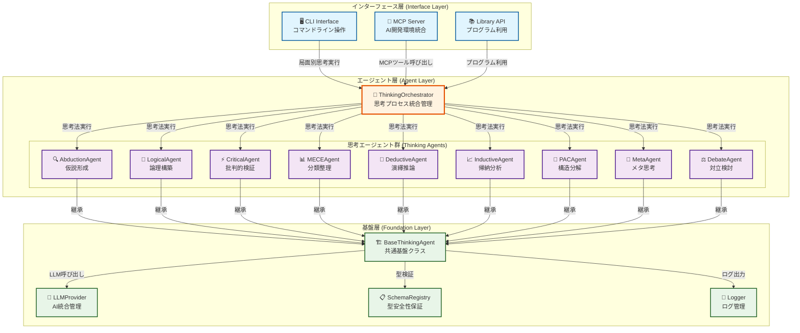

# Conflux アーキテクチャ設計書

## 目次

1. [はじめに](#はじめに)
   - [なぜConfluxが必要なのか](#なぜconfluxが必要なのか)
   - [Confluxとは](#confluxとは)
   - [この文書の構成](#この文書の構成)
2. [エージェントの定義と役割](#エージェントの定義と役割)
   - [エージェントとは](#エージェントとは)
   - [エージェントの役割](#エージェントの役割)
3. [設計原則](#設計原則)
   - [シンプルな設計](#1-シンプルな設計)
   - [透明性](#2-透明性)
   - [信頼性](#3-信頼性)
   - [拡張性](#4-拡張性)
4. [エージェントの構成要素](#エージェントの構成要素)
   - [アーキテクチャ概要](#アーキテクチャ概要)
   - [エージェントとコンピュータのインターフェース（ACI）](#エージェントとコンピュータのインターフェースaci)
5. [エージェントの実装手法](#エージェントの実装手法)
   - [ThinkingOrchestrator（思考オーケストレーター）](#1-thinkingorchestrator思考オーケストレーター)
   - [BaseThinkingAgent（ベースエージェント）](#2-basethinkingagentベースエージェント)
   - [LLMProvider（LLMプロバイダー）](#3-llmproviderllmプロバイダー)
6. [エージェントの評価と改善](#エージェントの評価と改善)
   - [エージェントの評価指標](#エージェントの評価指標)
   - [評価システムの実装](#評価システムの実装)
   - [思考法エージェント](#思考法エージェント)
7. [思考戦略](#思考戦略)
   - [局面別戦略マッピング](#局面別戦略マッピング)
   - [黄金パターン（Golden Pattern）](#黄金パターンgolden-pattern)
8. [型安全性とスキーマ設計](#型安全性とスキーマ設計)
   - [スキーマ設計の原則](#スキーマ設計の原則)
   - [基本型定義](#基本型定義)
   - [思考結果の型定義](#思考結果の型定義)
   - [各思考法のスキーマ](#各思考法のスキーマ)
9. [MCP統合](#mcp統合)
   - [MCPサーバー設計](#mcpサーバー設計)
10. [CLI設計](#cli設計)
    - [コマンドラインインターフェース](#コマンドラインインターフェース)
11. [品質保証](#品質保証)
    - [型安全性の確保](#型安全性の確保)
    - [テスト戦略](#テスト戦略)
12. [拡張性](#拡張性)
    - [カスタムエージェントの追加](#カスタムエージェントの追加)
    - [新規プロバイダーの追加](#新規プロバイダーの追加)
13. [パフォーマンスと信頼性](#パフォーマンスと信頼性)
    - [パフォーマンス最適化](#パフォーマンス最適化)
    - [エラーハンドリング](#エラーハンドリング)
14. [セキュリティ](#セキュリティ)
    - [APIキー管理](#apiキー管理)
    - [データ処理](#データ処理)
15. [Docker環境でのアーキテクチャ](#docker環境でのアーキテクチャ)
    - [コンテナ化戦略](#コンテナ化戦略)
    - [デプロイメントパターン](#デプロイメントパターン)
    - [ログとモニタリング](#ログとモニタリング)
16. [付録](#付録)
    - [システムの実際の使用例](#付録1-システムの実際の使用例)
    - [ツールの設計と統合](#付録2-ツールの設計と統合)
    - [実装ガイド](#付録3-実装ガイド)
17. [トラブルシューティング](#トラブルシューティング)
    - [よくある問題と解決方法](#よくある問題と解決方法)
    - [デバッグのベストプラクティス](#デバッグのベストプラクティス)
    - [サポートとコミュニティ](#サポートとコミュニティ)
18. [今後の拡張方向](#今後の拡張方向)

---

## はじめに

### なぜConfluxが必要なのか

現代のソフトウェア開発では、複雑な問題を解決するために多角的な思考が求められます。しかし、人間の認知能力には限界があり、一つの思考パターンに偏りがちです。Confluxは、この課題を解決するために設計されたマルチエージェントシステムです。

### Confluxとは

Confluxは、9つの構造化された思考法を組み合わせたマルチエージェントシステムです。各エージェントが特定の思考パターンに特化し、開発プロセスの各局面で最適な思考支援を提供します。

**主な特徴**:
- **9つの思考法**: アブダクション、ロジカル、クリティカル、MECE、演繹、帰納、PAC、メタ、ディベート
- **局面別最適化**: 15の開発局面に応じた思考戦略
- **透明性**: 思考プロセスの完全な可視化
- **信頼性**: 一貫した結果と自動復旧機能
- **拡張性**: 新しい思考法の容易な追加

**パッケージ名**: @53able/conflux  
**リポジトリ**: https://github.com/53able/conflux  
**最新バージョン**: [GitHub Releases](https://github.com/53able/conflux/releases)を参照

### この文書の構成

この文書では、Confluxのアーキテクチャを段階的に説明します：
1. **エージェントの定義と役割**: システムの基本概念
2. **設計原則**: 4つの主要な設計原則
3. **エージェントの構成要素**: システムアーキテクチャの詳細
4. **エージェントの実装手法**: 具体的な実装方法
5. **エージェントの評価と改善**: 性能評価と改善方法
6. **付録**: 実際の使用例とツール設計ガイド

## エージェントの定義と役割

### エージェントとは

Confluxにおけるエージェントは、特定の思考パターンに特化した独立したコンポーネントです。各エージェントは明確な入力・出力を持ち、予測可能な動作を保証します。

**エージェントの特徴**:
- **特化性**: 一つの思考法に集中し、その領域で最高の性能を発揮
- **独立性**: 他のエージェントに依存せず、単独で動作可能
- **一貫性**: 同じ入力に対して常に同じ形式の出力を生成
- **透明性**: 思考プロセスの各ステップを明確に記録

### エージェントの役割

#### 1. 思考プロセスの標準化

各エージェントは、特定の思考法の実行フローを標準化します：

```typescript
// 標準的な思考プロセス
async think(input: unknown, context: AgentContext): Promise<ThinkingResult> {
  // 1. 入力検証
  // 2. 前処理
  // 3. LLM実行（思考法固有のロジック）
  // 4. 後処理
  // 5. 結果返却
}
```

#### 2. 透明性の提供

エージェントは思考プロセスの各ステップを可視化します：

- **入力の分析**: どのような情報が与えられたか
- **思考の過程**: どのような推論を行ったか
- **結論の根拠**: なぜその結論に至ったか
- **次のステップ**: 推奨される次のアクション

#### 3. 信頼性の確保

一貫した結果とエラーハンドリングを提供します：

- **型安全性**: TypeScriptとZodによる厳密な型チェック
- **自動復旧**: LLM呼び出しの失敗時の自動再試行
- **エラーログ**: 問題の原因と解決方法の詳細記録

#### 4. 拡張性の実現

新しい思考法の容易な追加を可能にします：

- **統一されたインターフェース**: 一貫した実装方法
- **プラグインアーキテクチャ**: 既存システムへの影響なし
- **ドキュメント化されたAPI**: 拡張のための明確なガイドライン

## 設計原則

Confluxは、Building effective agentsの原則に基づいて設計されています。以下の4つの原則が、システム全体の設計指針となっています。

### 1. シンプルな設計

**原則**: 複雑さを排除し、本質的な機能に集中する

**実装例**:
```typescript
// 複雑な設定を避け、必要最小限のパラメータのみ
interface AgentConfig {
  methodType: ThinkingMethodType;
  llmProvider: string;
  timeout?: number;
}

// 明確な責務分離 - 各エージェントは単一の思考法に特化
class AbductionAgent extends BaseThinkingAgent {
  readonly capability: AgentCapability = {
    methodType: 'abduction',
    description: '驚きの事実から最尤説明仮説を形成',
    applicablePhases: ['business_exploration', 'debugging'],
    requiredInputSchema: AbductionInput,
    outputSchema: AbductionOutput,
    combinationSynergies: ['deductive', 'inductive', 'critical']
  };

  // アブダクション思考のみに特化した実装
  protected async executeLLMThinking(input: unknown, context: AgentContext) {
    // 驚きの事実から仮説を生成するロジック
    return await this.generateHypotheses(input, context);
  }
}
```

**効果**:
- 学習コストの削減
- デバッグの容易さ
- 保守性の向上

### 2. 透明性

**原則**: エージェントの動作を完全に可視化する

**実装例**:
```typescript
// 思考プロセスの詳細ログと追跡
const result = await agent.think(input, {
  llmProvider: globalLLMManager.getProvider(),
  sessionId: 'debug-session-001',
  metadata: {
    logLevel: 'detailed',
    includeReasoning: true,
    trackSteps: true
  }
});

// 実際の出力例（AbductionAgentの場合）
{
  method: 'abduction',
  status: 'completed',
  input: {
    surprisingFact: 'ユーザーがログインできない',
    context: 'モバイルアプリで発生',
    domain: '認証システム'
  },
  output: {
    hypotheses: [
      {
        explanation: '認証トークンの期限切れ',
        plausibility: 0.8,
        testablePredictions: ['トークンの有効期限を確認', '再認証フローをテスト']
      }
    ],
    recommendedNext: ['deductive', 'critical']
  },
  confidence: 0.8,
  reasoning: '観察された事実から最も可能性の高い説明を生成',
  metadata: {
    executionTime: 1250,
    timestamp: '2024-01-15T10:30:00Z',
    llmProvider: 'openai',
    model: 'gpt-4o'
  }
}
```

**効果**:
- デバッグの効率化
- 信頼性の向上
- 学習効果の促進

### 3. 信頼性

**原則**: 一貫した結果と予測可能な動作を保証する

**実装例**:
```typescript
// 自動復旧機能付きLLM呼び出し（実際の実装）
protected async callLLMWithStructuredOutput<T>(
  schema: ZodSchema<T>,
  systemPrompt: string,
  userPrompt: string,
  context: AgentContext,
  options?: {
    temperature?: number;
    maxRetries?: number;
    enableAutoRecovery?: boolean;
  }
): Promise<T> {
  const maxRetries = options?.maxRetries ?? 3;
  let lastError: Error | null = null;
  
  for (let attempt = 1; attempt <= maxRetries; attempt++) {
    try {
      // AI SDKのgenerateObjectを使用（スキーマ保証）
      const result = await generateObject({
        model: context.llmProvider as LanguageModel,
        schema,
        system: systemPrompt,
        prompt: userPrompt,
        temperature: options?.temperature ?? 0.3,
        mode: 'json'
      });
      
      return result.object as T;
    } catch (error) {
      lastError = error instanceof Error ? error : new Error('Unknown error');
      this.logger.warn('LLM generation attempt failed', {
        attempt,
        maxRetries,
        error: lastError.message
      });
      
      if (attempt < maxRetries) {
        // 指数バックオフで再試行
        await this.sleep(Math.pow(2, attempt) * 1000);
      }
    }
  }
  
  throw new Error(`LLM generation failed after ${maxRetries} attempts: ${lastError?.message}`);
}
```

**効果**:
- システムの安定性
- ユーザー体験の向上
- 運用コストの削減

### 4. 拡張性

**原則**: 新しい思考法の容易な追加を可能にする

**実装例**:
```typescript
// カスタムエージェントの追加
class CustomThinkingAgent extends BaseThinkingAgent {
  readonly capability: AgentCapability = {
    methodType: 'custom',
    description: 'カスタム思考法',
    applicablePhases: ['implementation'],
    requiredInputSchema: z.object({
      problem: z.string(),
      context: z.string().optional()
    }),
    outputSchema: z.object({
      solution: z.string(),
      confidence: z.number().min(0).max(1)
    })
  };
  
  protected async executeLLMThinking(input: unknown, context: AgentContext) {
    // カスタムロジックの実装
  }
}

// エージェントの登録
orchestrator.registerAgent(new CustomThinkingAgent());
```

**効果**:
- システムの柔軟性
- 将来の拡張への対応
- カスタマイズの容易さ

## エージェントの構成要素

### アーキテクチャ概要

Confluxは3層のアーキテクチャで構成され、各層が明確な責務を持ちます：



### エージェントとコンピュータのインターフェース（ACI）

各エージェントは以下の標準インターフェースで動作します：

```typescript
interface IThinkingAgent {
  readonly capability: AgentCapability;
  think(input: unknown, context: AgentContext): Promise<ThinkingResult>;
}
```

この設計により、エージェントの動作が予測可能で、デバッグとテストが容易になります。

## エージェントの実装手法

### 1. ThinkingOrchestrator（思考オーケストレーター）

**目的**: 複数の思考エージェントを統合し、開発局面に応じた最適な思考プロセスを実行

**実装の透明性**:
- 各エージェントの能力を明確に定義
- 思考プロセスの各ステップを追跡可能
- エラーハンドリングと復旧戦略を明示

**主要機能の実装**:
```typescript
class ThinkingOrchestrator {
  private agents: Map<ThinkingMethodType, IThinkingAgent> = new Map();
  private phaseStrategyMap: Map<DevelopmentPhase, ThinkingStrategy> = new Map();

  // 局面別思考戦略の実行
  async processPhase(phase: DevelopmentPhase, input: unknown): Promise<IntegratedThinkingResult> {
    const strategy = this.phaseStrategyMap.get(phase);
    if (!strategy) {
      throw new Error(`No strategy defined for phase: ${phase}`);
    }

    const results: ThinkingResult[] = [];
    
    // 主要思考法の実行
    const primaryResult = await this.executeAgent(strategy.primaryMethod, input);
    results.push(primaryResult);

    // 併用思考法の並列実行
    const secondaryResults = await Promise.all(
      strategy.secondaryMethods.map(method => 
        this.executeAgent(method, input)
      )
    );
    results.push(...secondaryResults);

    // 結果の統合
    return this.synthesizeResults(phase, results);
  }

  // 黄金パターン（探索→実装）の実行
  async processGoldenPattern(input: unknown): Promise<IntegratedThinkingResult> {
    const sequence = ['abduction', 'deductive', 'inductive', 'critical', 'logical', 'meta', 'debate'];
    const results: ThinkingResult[] = [];
    let currentInput = input;

    for (const method of sequence) {
      const result = await this.executeAgent(method as ThinkingMethodType, currentInput);
      results.push(result);
      currentInput = result.output; // 次のエージェントの入力として使用
    }

    return this.synthesizeResults('golden_pattern', results);
  }

  // 単一思考法の実行
  async processSingleMethod(method: ThinkingMethodType, input: unknown): Promise<ThinkingResult> {
    return await this.executeAgent(method, input);
  }

  private async executeAgent(method: ThinkingMethodType, input: unknown): Promise<ThinkingResult> {
    const agent = this.agents.get(method);
    if (!agent) {
      throw new Error(`Agent not found: ${method}`);
    }

    try {
      return await agent.think(input, { methodType: method });
    } catch (error) {
      this.logger.error(`Agent execution failed: ${method}`, error);
      throw error;
    }
  }
}
```

**エージェント管理**:
- 各思考法エージェントの登録・管理
- エージェント間の依存関係の解決
- 並列実行可能なエージェントの特定

### 2. BaseThinkingAgent（ベースエージェント）

**目的**: 全思考エージェントの共通基盤を提供し、一貫した動作を保証

**実装原則**:
- 単一の責任：思考プロセスの標準化
- 明確なインターフェース：予測可能な動作
- 自動復旧：LLM呼び出しの信頼性向上

**Template Methodパターンの実装**:
```typescript
abstract class BaseThinkingAgent implements IThinkingAgent {
  constructor(
    protected llmProvider: LLMProvider,
    protected logger: Logger,
    public readonly capability: AgentCapability
  ) {}

  // 標準思考プロセス（変更不可）
  async think(input: unknown, context: AgentContext): Promise<ThinkingResult> {
    const startTime = Date.now();
    
    try {
      // 1. 入力検証
      const validatedInput = this.validateInput(input);
      
      // 2. 前処理
      const processedInput = await this.preprocess(validatedInput, context);
      
      // 3. LLM実行（サブクラスで実装）
      const llmOutput = await this.executeLLMThinking(processedInput, context);
      
      // 4. 後処理
      const processedOutput = await this.postprocess(llmOutput, context);
      
      // 5. 結果返却
      return {
        method: this.capability.methodType,
        status: 'completed',
        input: validatedInput,
        output: processedOutput,
        confidence: this.calculateConfidence(processedOutput),
        reasoning: this.generateReasoning(processedInput, processedOutput),
        metadata: {
          executionTime: Date.now() - startTime,
          timestamp: new Date().toISOString()
        }
      };
    } catch (error) {
      this.logger.error(`Agent execution failed: ${this.capability.methodType}`, error);
      return {
        method: this.capability.methodType,
        status: 'failed',
        input,
        confidence: 0,
        reasoning: `Error: ${error.message}`,
        metadata: { error: error.message }
      };
    }
  }

  // サブクラスで実装（各思考法の固有ロジック）
  protected abstract executeLLMThinking(input: unknown, context: AgentContext): Promise<Record<string, unknown>>;

  // 共通の前処理
  protected async preprocess(input: unknown, context: AgentContext): Promise<unknown> {
    // 入力の正規化や変換
    return input;
  }

  // 共通の後処理
  protected async postprocess(output: Record<string, unknown>, context: AgentContext): Promise<Record<string, unknown>> {
    // 出力の検証や変換
    return this.capability.outputSchema.parse(output);
  }

  // 入力検証
  protected validateInput(input: unknown): unknown {
    return this.capability.requiredInputSchema.parse(input);
  }

  // 信頼度の計算
  protected calculateConfidence(output: Record<string, unknown>): number {
    // デフォルトの信頼度計算ロジック
    return 0.8;
  }

  // 推論過程の生成
  protected generateReasoning(input: unknown, output: Record<string, unknown>): string {
    return `Applied ${this.capability.methodType} thinking to analyze the input and generate the output.`;
  }
}
```

**信頼性の確保**:
- 自動復旧機能付きLLM呼び出し
- スキーマ検証による型安全性
- 詳細なエラーログとデバッグ情報

### 3. LLMProvider（LLMプロバイダー）

**目的**: 複数のLLMプロバイダーを統一的に管理し、信頼性の高いLLM呼び出しを提供

**対応プロバイダー**:
- OpenAI (GPT-4o, GPT-4o-mini)
- Anthropic (Claude 3.5 Sonnet, Claude 3 Haiku)
- Google (Gemini 1.5 Pro, Gemini 1.5 Flash)
- OpenAI互換エンドポイント

**実装設計**:
```typescript
interface LLMProvider {
  generateStructuredOutput<T>(
    schema: ZodSchema<T>,
    prompt: string,
    options?: LLMOptions
  ): Promise<T>;
}
```

**信頼性の確保**:
- 自動フォールバック（プロバイダー障害時）
- 指数バックオフによる再試行
- レート制限の自動対応
- プロバイダー健康チェック

**透明性の提供**:
- 呼び出しログの詳細記録
- パフォーマンスメトリクスの収集
- エラー原因の明確化

## エージェントの評価と改善

### エージェントの評価指標

**性能評価**:
- 実行時間とリソース使用量
- 成功率とエラー率
- 出力品質の一貫性

**改善方法**:
- ログ分析によるボトルネック特定
- パフォーマンスメトリクスの監視
- 継続的な最適化

### 評価システムの実装

**メトリクス収集**:
```typescript
interface AgentMetrics {
  methodType: ThinkingMethodType;
  executionTime: number;
  successRate: number;
  errorRate: number;
  averageConfidence: number;
  totalExecutions: number;
  lastExecuted: Date;
}

class MetricsCollector {
  private metrics: Map<ThinkingMethodType, AgentMetrics> = new Map();

  recordExecution(method: ThinkingMethodType, result: ThinkingResult) {
    const current = this.metrics.get(method) || this.initializeMetrics(method);
    
    current.executionTime = (current.executionTime + result.metadata.executionTime) / 2;
    current.totalExecutions++;
    current.lastExecuted = new Date();
    
    if (result.status === 'completed') {
      current.successRate = (current.successRate + 1) / current.totalExecutions;
      current.averageConfidence = (current.averageConfidence + result.confidence) / 2;
    } else {
      current.errorRate = (current.errorRate + 1) / current.totalExecutions;
    }
    
    this.metrics.set(method, current);
  }

  getMetrics(method: ThinkingMethodType): AgentMetrics | undefined {
    return this.metrics.get(method);
  }

  getAllMetrics(): AgentMetrics[] {
    return Array.from(this.metrics.values());
  }
}
```

**パフォーマンス監視**:
```typescript
class PerformanceMonitor {
  private metricsCollector: MetricsCollector;
  private alertThresholds: PerformanceThresholds;

  constructor(metricsCollector: MetricsCollector) {
    this.metricsCollector = metricsCollector;
    this.alertThresholds = {
      maxExecutionTime: 30000, // 30秒
      minSuccessRate: 0.8,     // 80%
      maxErrorRate: 0.2        // 20%
    };
  }

  checkPerformance(method: ThinkingMethodType): PerformanceAlert[] {
    const metrics = this.metricsCollector.getMetrics(method);
    if (!metrics) return [];

    const alerts: PerformanceAlert[] = [];

    if (metrics.executionTime > this.alertThresholds.maxExecutionTime) {
      alerts.push({
        type: 'slow_execution',
        method,
        value: metrics.executionTime,
        threshold: this.alertThresholds.maxExecutionTime
      });
    }

    if (metrics.successRate < this.alertThresholds.minSuccessRate) {
      alerts.push({
        type: 'low_success_rate',
        method,
        value: metrics.successRate,
        threshold: this.alertThresholds.minSuccessRate
      });
    }

    return alerts;
  }
}
```

**継続的改善**:
```typescript
class AgentOptimizer {
  private performanceMonitor: PerformanceMonitor;
  private logger: Logger;

  constructor(performanceMonitor: PerformanceMonitor, logger: Logger) {
    this.performanceMonitor = performanceMonitor;
    this.logger = logger;
  }

  async optimizeAgent(method: ThinkingMethodType): Promise<OptimizationResult> {
    const alerts = this.performanceMonitor.checkPerformance(method);
    
    if (alerts.length === 0) {
      return { optimized: false, reason: 'No performance issues detected' };
    }

    const optimizations: Optimization[] = [];

    for (const alert of alerts) {
      switch (alert.type) {
        case 'slow_execution':
          optimizations.push(await this.optimizeExecutionTime(method));
          break;
        case 'low_success_rate':
          optimizations.push(await this.optimizeSuccessRate(method));
          break;
      }
    }

    return {
      optimized: true,
      optimizations,
      performanceGain: this.calculatePerformanceGain(optimizations)
    };
  }

  private async optimizeExecutionTime(method: ThinkingMethodType): Promise<Optimization> {
    // 実行時間の最適化ロジック
    return {
      type: 'execution_time',
      description: 'Optimized LLM prompt and reduced processing steps',
      expectedImprovement: 0.2
    };
  }

  private async optimizeSuccessRate(method: ThinkingMethodType): Promise<Optimization> {
    // 成功率の最適化ロジック
    return {
      type: 'success_rate',
      description: 'Improved error handling and retry logic',
      expectedImprovement: 0.15
    };
  }
}
```

### 思考法エージェント

各エージェントは特定の思考パターンに特化し、明確な入力・出力を持つシンプルな設計です。

### 1. AbductionAgent（アブダクションエージェント）

**目的**: 驚くべき事実から最も可能性の高い説明仮説を生成

**適用場面**: バグの原因調査、事業機会の発見、実験結果の解釈

**入力**:
```typescript
{
  surprisingFact: string;    // 観察された驚くべき事実
  context?: string;          // 背景情報
  domain?: string;          // 対象ドメイン
}
```

**出力**:
```typescript
{
  hypotheses: Array<{
    explanation: string;           // 仮説の説明
    plausibility: number;         // 可能性（0-1）
    testablePredictions: string[]; // 検証可能な予測
  }>;
  recommendedNext: ThinkingMethodType[]; // 次の推奨思考法
}
```

**思考プロセスの透明性**:
1. 事実の分析と特徴抽出
2. 可能な説明仮説の生成
3. 各仮説の妥当性評価
4. 検証方法の提案

### 2. LogicalAgent（ロジカルエージェント）

**目的**: 論点から結論への論理的道筋を構築

**適用場面**: 要件定義、優先順位付け、見積もり・計画

**思考プロセス**:
1. 論点の明確化
2. 根拠の整理
3. 論理的道筋の構築
4. 結論の妥当性検証

### 3. CriticalAgent（クリティカルエージェント）

**目的**: 前提・論点・根拠を体系的に検証

**適用場面**: コードレビュー、要件定義、リファクタリング

**思考プロセス**:
1. 前提の特定と検証
2. 論理の飛躍の特定
3. バイアスの検出
4. 代替解の検討

### 4. MECEAgent（MECEエージェント）

**目的**: 項目を漏れなく重複なく分類

**適用場面**: 優先順位付け、テスト設計、リファクタリング

**思考プロセス**:
1. 分類軸の設定
2. 完全性の確認
3. 排他性の確認
4. 階層構造の構築

### 5. DeductiveAgent（演繹エージェント）

**目的**: 一般的な原則から具体的な結論を導出

**適用場面**: アーキテクチャ設計、実装、テスト設計

**思考プロセス**:
1. 一般原則の適用
2. 三段論法の構築
3. 結論の論理的導出
4. 妥当性の検証

### 6. InductiveAgent（帰納エージェント）

**目的**: 個別事例から共通パターンを発見

**適用場面**: 価値仮説、実験、デバッグ

**思考プロセス**:
1. 事例の収集と分析
2. 共通パターンの発見
3. 一般化の導出
4. 統計的検証

### 7. PACAgent（PACエージェント）

**目的**: 前提・仮定・結論に分解して検証

**適用場面**: 仮説分解、ふりかえり

**思考プロセス**:
1. 前提の明確化
2. 仮定の特定
3. 結論の検証
4. 論理構造の分析

### 8. MetaAgent（メタエージェント）

**目的**: 思考プロセス自体を評価・改善

**適用場面**: ふりかえり、見積もり・計画、意思決定

**思考プロセス**:
1. 思考プロセスの分析
2. 改善点の特定
3. 最適化の提案
4. 学習の促進

### 9. DebateAgent（ディベートエージェント）

**目的**: 賛成・反対論点で意思決定支援

**適用場面**: 意思決定、アーキテクチャ設計

**思考プロセス**:
1. 賛成論点の整理
2. 反対論点の整理
3. 対立点の明確化
4. 総合判断の支援

### エージェントの評価指標

**性能評価**:
- 実行時間とリソース使用量
- 成功率とエラー率
- 出力品質の一貫性

**改善方法**:
- ログ分析によるボトルネック特定
- パフォーマンスメトリクスの監視
- 継続的な最適化

## 思考戦略

### 局面別戦略マッピング

各開発局面に最適な思考法の組み合わせを定義：

| 局面 | 主要思考法 | 併用思考法 | 目的 |
|------|------------|------------|------|
| business_exploration | abduction | inductive, deductive, meta | 驚きから仮説形成 |
| requirement_definition | logical | mece, critical | 論点→結論の道筋 |
| value_hypothesis | inductive | critical | データから一般化 |
| architecture_design | deductive | debate | 原則→設計結論 |
| prioritization | mece | logical | 粒度揃え・重複排除 |
| estimation_planning | logical | meta | 前提→分解→見積 |
| implementation | deductive | critical | 原則→具体コード |
| debugging | abduction | deductive, inductive | 兆候→原因仮説 |
| refactoring | critical | mece, logical | 前提・依存を疑う |
| code_review | critical | deductive, mece | 結論↔根拠の検証 |
| test_design | deductive | mece, inductive | 仕様→条件導出 |
| experimentation | inductive | critical | データ→効果一般化 |
| decision_making | debate | meta | 賛否論点の顕在化 |
| retrospective | meta | logical, pac | 思考プロセス見直し |
| hypothesis_breakdown | pac | critical | 前提・仮定・結論分解 |

### 黄金パターン（Golden Pattern）

**目的**: 探索から実装までの統合フローを提供

**シーケンス**: abduction → deductive → inductive → critical → logical → meta → debate

**特徴**:
- 各思考法の出力が次の思考法の入力となる連鎖構造
- 段階的な思考の深化
- 包括的な問題解決アプローチ

## 型安全性とスキーマ設計

### スキーマ設計の原則

**シンプルな設計**: 必要最小限の型定義で最大の型安全性を確保

**透明性**: 各スキーマの目的と制約を明確に定義

**信頼性**: 実行時型チェックによる堅牢性の保証

### 基本型定義

```typescript
// 思考法の種類
type ThinkingMethodType = 
  | 'abduction' | 'logical' | 'critical' | 'mece' 
  | 'deductive' | 'inductive' | 'pac' | 'meta' | 'debate';

// 開発局面
type DevelopmentPhase = 
  | 'business_exploration' | 'requirement_definition' 
  | 'value_hypothesis' | 'architecture_design'
  | 'prioritization' | 'estimation_planning'
  | 'implementation' | 'debugging' | 'refactoring'
  | 'code_review' | 'test_design' | 'experimentation'
  | 'decision_making' | 'retrospective' | 'hypothesis_breakdown';
```

### 思考結果の型定義

```typescript
// 単一思考結果
interface ThinkingResult {
  method: ThinkingMethodType;
  status: 'pending' | 'in_progress' | 'completed' | 'failed';
  input: Record<string, unknown>;
  output?: Record<string, unknown>;
  confidence: number; // 0-1
  reasoning: string;
  nextRecommendations?: ThinkingMethodType[];
  metadata?: Record<string, unknown>;
}

// 統合思考結果
interface IntegratedThinkingResult {
  phase: DevelopmentPhase;
  primaryMethod: ThinkingMethodType;
  secondaryMethods: ThinkingMethodType[];
  results: ThinkingResult[];
  synthesis: string;
  actionItems: string[];
  confidence: number;
  nextSteps: string[];
}
```

### 各思考法のスキーマ

各思考法は専用の入出力スキーマを持ち、Zodによる実行時検証を実装：

- `AbductionInput` / `AbductionOutput`
- `LogicalInput` / `LogicalOutput`
- `CriticalInput` / `CriticalOutput`
- `MECEInput` / `MECEOutput`
- `DeductiveInput` / `DeductiveOutput`
- `InductiveInput` / `InductiveOutput`
- `PACInput` / `PACOutput`
- `MetaInput` / `MetaOutput`
- `DebateInput` / `DebateOutput`

## MCP統合

### MCPサーバー設計

**目的**: AI開発環境との統合を提供し、思考エージェントをツールとして利用可能にする

**提供ツール**:
- `process-phase`: 局面別統合思考プロセス
- `process-golden-pattern`: 黄金パターン実行
- `process-single-method`: 単一思考法実行
- `list-thinking-methods`: 思考法一覧取得
- `get-phase-recommendations`: 局面別推奨取得

**設定例**:
```json
{
  "mcpServers": {
    "thinking-agents": {
      "command": "npx",
      "args": ["@53able/conflux", "server"],
      "env": {
        "OPENAI_API_KEY": "sk-proj-...",
        "DEFAULT_LLM_PROVIDER": "openai"
      }
    }
  }
}
```

**透明性の確保**:
- 各ツールの動作ログを詳細に記録
- エラーの原因と解決方法を明確に提示
- パフォーマンスメトリクスの提供

## CLI設計

### コマンドラインインターフェース

**目的**: 開発者が思考エージェントを簡単に利用できるインターフェースを提供

**シンプルな設計**:
```bash
# 局面別思考プロセス
conflux phase debugging '{"issue": "APIエラー", "context": "DB問題"}'

# 黄金パターン実行
conflux golden '{"problem": "アーキテクチャ設計"}'

# 単一思考法
conflux single critical '{"claim": "この実装で十分"}'

# 思考法一覧
conflux list

# 局面別推奨
conflux recommend debugging

# MCPサーバー起動
conflux server
```

**透明性の提供**:
- 各コマンドの実行ログを詳細に表示
- エラー時の解決方法を提示
- 実行時間とリソース使用量の表示

## 品質保証

### 型安全性の確保

**TypeScript厳密モード**:
```json
{
  "compilerOptions": {
    "target": "ES2022",
    "module": "ESNext",
    "moduleResolution": "bundler",
    "strict": true,
    "noImplicitAny": true,
    "exactOptionalPropertyTypes": true,
    "declaration": true,
    "declarationMap": true,
    "sourceMap": true
  }
}
```

**ESLint設定**:
- any型完全禁止
- 未使用変数検出
- 一貫した命名規則
- TypeScript v5.6対応
- ESLint v9対応

### テスト戦略

**シンプルなテスト設計**:
- 単体テスト（各エージェント）
- 統合テスト（オーケストレーター）
- E2Eテスト（CLI・MCP）

**信頼性の確保**:
- 自動テストの実行
- カバレッジレポートの生成
- 継続的インテグレーション

## 拡張性

### カスタムエージェントの追加

**シンプルな拡張設計**:
```typescript
class CustomThinkingAgent extends BaseThinkingAgent {
  readonly capability: AgentCapability = {
    methodType: 'custom',
    description: 'カスタム思考法',
    applicablePhases: ['implementation'],
    requiredInputSchema: z.object({ /* スキーマ */ }),
    outputSchema: z.object({ /* 出力スキーマ */ }),
    combinationSynergies: ['critical', 'logical'],
  };
  
  protected async executeLLMThinking(input: unknown, context: AgentContext) {
    // カスタムロジック実装
  }
}
```

### 新規プロバイダーの追加

**統一されたインターフェース**:
```typescript
// カスタムLLMプロバイダーの追加
globalLLMManager.registerProvider('custom', {
  type: 'openai-compatible',
  baseURL: 'https://api.custom-llm.com/v1',
  model: 'custom-model',
  apiKey: 'custom-key',
});
```

**透明性の確保**:
- 拡張ポイントの明確な定義
- ドキュメント化されたインターフェース
- サンプルコードの提供

## パフォーマンスと信頼性

### パフォーマンス最適化

**並列処理**:
- 独立した思考法は並列実行可能
- LLM呼び出しの最適化
- キャッシュ戦略

**リソース管理**:
- プロバイダー選択最適化
- レート制限対応
- メモリ使用量最適化

### エラーハンドリング

**自動復旧機能**:
- フォールバックプロバイダー
- 指数バックオフによる再試行
- 詳細なエラーログ

**信頼性の確保**:
- プロバイダー健康チェック
- 自動復旧メカニズム
- グレースフルデグラデーション

## セキュリティ

### APIキー管理

**セキュアな設定**:
- 環境変数ベースの設定
- プロバイダー固有の認証
- セキュアな設定管理

### データ処理

**データ保護**:
- 入力検証（Zod）
- 出力サニタイゼーション
- 機密情報の保護

## Docker環境でのアーキテクチャ

### コンテナ化戦略

**目的**: 本番環境での使用に最適化されたDockerコンテナを提供

**シンプルな設計**:
```dockerfile
# ビルドステージ
FROM node:20-alpine AS builder
RUN npm install -g pnpm
WORKDIR /app
COPY package.json pnpm-lock.yaml ./
RUN pnpm install --frozen-lockfile
COPY . .
RUN pnpm run build

# 本番ステージ
FROM node:20-alpine AS production
RUN npm install -g pnpm
WORKDIR /app
COPY package.json pnpm-lock.yaml ./
RUN pnpm install --frozen-lockfile --prod
COPY --from=builder /app/dist ./dist
RUN addgroup -g 1001 -S nodejs && adduser -S conflux -u 1001
RUN chown -R conflux:nodejs /app
USER conflux
CMD ["node", "dist/mcp/server.js"]
```

**セキュリティ設計**:
- 非rootユーザー実行
- 最小権限の原則
- Alpine Linuxベース
- マルチステージビルド

**Docker Compose設定**:
```yaml
version: '3.8'
services:
  mcp-server:
    build: 
      context: .
      target: production
    environment:
      - NODE_ENV=production
      - OPENAI_API_KEY=${OPENAI_API_KEY}
      - ANTHROPIC_API_KEY=${ANTHROPIC_API_KEY}
      - DEFAULT_LLM_PROVIDER=${DEFAULT_LLM_PROVIDER:-openai}
    stdin_open: true
    tty: true
    restart: unless-stopped
```

### デプロイメントパターン

**単一コンテナデプロイメント**:
```bash
# 直接実行
docker run -it --rm \
  -e OPENAI_API_KEY=your_key \
  conflux-mcp

# バックグラウンド実行
docker run -d --name conflux-mcp \
  -e OPENAI_API_KEY=your_key \
  conflux-mcp
```

**Docker Composeデプロイメント**:
```bash
# 開発環境
docker compose --env-file .env.docker up --build

# 本番環境
docker compose -f docker-compose.yml -f docker-compose.prod.yml up -d
```

**Kubernetesデプロイメント**:
```yaml
apiVersion: apps/v1
kind: Deployment
metadata:
  name: conflux-mcp
spec:
  replicas: 1
  selector:
    matchLabels:
      app: conflux-mcp
  template:
    metadata:
      labels:
        app: conflux-mcp
    spec:
      containers:
      - name: conflux-mcp
        image: conflux-mcp:latest
        env:
        - name: OPENAI_API_KEY
          valueFrom:
            secretKeyRef:
              name: conflux-secrets
              key: openai-api-key
        stdin: true
        tty: true
```

### ログとモニタリング

**Winstonログ設定**:
```typescript
const logger = createLogger({
  level: 'info',
  format: format.combine(
    format.timestamp(),
    format.errors({ stack: true }),
    format.json()
  ),
  transports: [
    new transports.Console(),
    new transports.File({ filename: 'mcp-server.log' })
  ]
});
```

**ヘルスチェック**:
```yaml
healthcheck:
  test: ["CMD", "node", "-e", "process.exit(0)"]
  interval: 30s
  timeout: 10s
  retries: 3
```

## 付録

### 付録1: システムの実際の使用例

#### カスタマーサポートエージェント

**シナリオ**: ユーザーからのログイン問題の報告を分析

```typescript
// バグ報告の分析
const result = await orchestrator.processPhase('debugging', {
  issue: 'ユーザーがログインできない',
  context: 'モバイルアプリで発生',
  domain: '認証システム'
});

// 出力例
{
  hypotheses: [
    {
      explanation: 'モバイルアプリの認証トークンが期限切れ',
      plausibility: 0.8,
      testablePredictions: ['トークンの有効期限を確認', '再認証フローをテスト']
    },
    {
      explanation: 'ネットワーク接続の問題でAPI呼び出しが失敗',
      plausibility: 0.6,
      testablePredictions: ['ネットワーク接続を確認', 'APIエンドポイントの応答をテスト']
    }
  ],
  recommendedNext: ['deductive', 'critical']
}
```

**次のステップ**: 演繹的思考で仮説を検証
```typescript
const verification = await orchestrator.processSingleMethod('deductive', {
  hypothesis: '認証トークンが期限切れ',
  evidence: 'ユーザーが最後にログインしたのは1週間前',
  rule: 'トークンの有効期限は24時間'
});
```

#### コーディングエージェント

**シナリオ**: アーキテクチャ設計の支援

```typescript
// アーキテクチャ設計の支援
const result = await orchestrator.processPhase('architecture_design', {
  requirements: 'マイクロサービス化が必要',
  constraints: 'レガシーシステムとの統合',
  domain: 'ECサイト'
});

// 出力例
{
  architecture: {
    pattern: 'Strangler Fig Pattern',
    services: ['User Service', 'Product Service', 'Order Service'],
    integration: 'API Gateway + Event Sourcing',
    migration: '段階的な移行戦略'
  },
  reasoning: 'レガシーシステムを段階的に置き換えることで、リスクを最小化',
  confidence: 0.85
}
```

#### プロダクトマネージャーエージェント

**シナリオ**: 機能の優先順位付け

```typescript
const result = await orchestrator.processPhase('prioritization', {
  features: [
    { name: 'ユーザー認証', impact: 'high', effort: 'medium' },
    { name: '商品検索', impact: 'high', effort: 'low' },
    { name: 'レコメンデーション', impact: 'medium', effort: 'high' }
  ],
  constraints: 'リリースまで2週間'
});

// 出力例
{
  prioritized: [
    { feature: '商品検索', priority: 1, reason: '高インパクト・低工数' },
    { feature: 'ユーザー認証', priority: 2, reason: '高インパクト・中工数' },
    { feature: 'レコメンデーション', priority: 3, reason: '中インパクト・高工数' }
  ],
  reasoning: '時間制約を考慮し、ROIの高い機能を優先'
}
```

### 付録2: ツールの設計と統合

#### MCPツールの設計原則

1. **明確な目的**: 各ツールの役割を明確に定義
2. **一貫したインターフェース**: 統一されたパラメータ形式
3. **エラーハンドリング**: 適切なエラーメッセージと復旧方法
4. **ドキュメント化**: 使用例とパラメータの詳細説明

#### ツール統合のベストプラクティス

**ツール定義の例**:
```typescript
const processPhaseTool = {
  name: 'process-phase',
  description: '局面別統合思考プロセスを実行',
  inputSchema: {
    type: 'object',
    properties: {
      phase: { 
        type: 'string', 
        enum: Object.values(DevelopmentPhase),
        description: '実行する開発局面'
      },
      input: { 
        type: 'object',
        description: '思考プロセスへの入力データ'
      }
    },
    required: ['phase', 'input']
  },
  outputSchema: {
    type: 'object',
    properties: {
      results: { type: 'array' },
      synthesis: { type: 'string' },
      actionItems: { type: 'array' },
      confidence: { type: 'number' }
    }
  }
};
```

**エラーハンドリング**:
```typescript
class MCPToolHandler {
  async handleToolCall(toolName: string, parameters: unknown): Promise<ToolResult> {
    try {
      const result = await this.executeTool(toolName, parameters);
      return {
        success: true,
        data: result,
        metadata: {
          executionTime: result.metadata.executionTime,
          timestamp: new Date().toISOString()
        }
      };
    } catch (error) {
      return {
        success: false,
        error: {
          type: error.constructor.name,
          message: error.message,
          stack: error.stack
        },
        suggestions: this.generateErrorSuggestions(error)
      };
    }
  }

  private generateErrorSuggestions(error: Error): string[] {
    if (error.message.includes('Invalid phase')) {
      return [
        '有効な局面を指定してください',
        '利用可能な局面: business_exploration, requirement_definition, ...'
      ];
    }
    if (error.message.includes('Invalid input')) {
      return [
        '入力データの形式を確認してください',
        'スキーマに従った正しい形式で入力してください'
      ];
    }
    return ['エラーの詳細を確認し、入力パラメータを再確認してください'];
  }
}
```

### 付録3: 実装ガイド

#### 新しいエージェントの追加手順

1. **エージェントクラスの作成**:
```typescript
class NewThinkingAgent extends BaseThinkingAgent {
  readonly capability: AgentCapability = {
    methodType: 'new_method',
    description: '新しい思考法',
    applicablePhases: ['implementation', 'debugging'],
    requiredInputSchema: z.object({
      problem: z.string(),
      context: z.string().optional()
    }),
    outputSchema: z.object({
      solution: z.string(),
      confidence: z.number().min(0).max(1),
      reasoning: z.string()
    }),
    combinationSynergies: ['critical', 'logical']
  };

  protected async executeLLMThinking(input: unknown, context: AgentContext) {
    // 新しい思考法の実装
    const prompt = this.buildPrompt(input);
    return await this.llmProvider.generateStructuredOutput(
      this.capability.outputSchema,
      prompt
    );
  }

  private buildPrompt(input: unknown): string {
    // プロンプトの構築ロジック
    return `新しい思考法を適用して問題を解決してください...`;
  }
}
```

2. **エージェントの登録**:
```typescript
// オーケストレーターに登録
orchestrator.registerAgent(new NewThinkingAgent(llmProvider, logger));

// 局面別戦略に追加
orchestrator.addPhaseStrategy('implementation', {
  primaryMethod: 'new_method',
  secondaryMethods: ['critical', 'logical']
});
```

3. **テストの作成**:
```typescript
describe('NewThinkingAgent', () => {
  it('should generate valid output for valid input', async () => {
    const agent = new NewThinkingAgent(mockLLMProvider, mockLogger);
    const input = { problem: 'テスト問題', context: 'テストコンテキスト' };
    
    const result = await agent.think(input, { methodType: 'new_method' });
    
    expect(result.status).toBe('completed');
    expect(result.output).toMatchSchema(agent.capability.outputSchema);
    expect(result.confidence).toBeGreaterThan(0);
  });
});
```

## トラブルシューティング

### よくある問題と解決方法

#### 1. LLMプロバイダーの接続エラー

**問題**: APIキーが無効または設定されていない
```
Error: OpenAI API key is required
```

**解決方法**:
```bash
# 環境変数の設定
export OPENAI_API_KEY="sk-proj-..."
export ANTHROPIC_API_KEY="sk-ant-..."
export GOOGLE_GENERATIVE_AI_API_KEY="AIza..."

# または .env ファイルの作成
echo "OPENAI_API_KEY=sk-proj-..." > .env
echo "DEFAULT_LLM_PROVIDER=openai" >> .env
```

#### 2. スキーマ検証エラー

**問題**: LLMの出力が期待されるスキーマと一致しない
```
Error: Schema validation failed: Expected string, received number
```

**解決方法**:
```typescript
// プロンプトの改善
const systemPrompt = `あなたは${this.capability.methodType}思考の専門家です。
必ず以下のJSON形式で出力してください：
${this.generateSchemaExample(this.capability.outputSchema)}`;

// 温度パラメータの調整
const result = await this.callLLMWithStructuredOutput(
  schema,
  systemPrompt,
  userPrompt,
  context,
  { temperature: 0.1 } // より低い温度で一貫性を向上
);
```

#### 3. エージェント実行タイムアウト

**問題**: 思考プロセスが長時間実行される
```
Error: Agent execution timeout after 30000ms
```

**解決方法**:
```typescript
// タイムアウト設定の調整
const context: AgentContext = {
  llmProvider: globalLLMManager.getProvider(),
  sessionId: 'session-001',
  metadata: {
    timeout: 60000, // 60秒に延長
    maxRetries: 2   // 再試行回数を削減
  }
};
```

#### 4. MCPサーバー接続エラー

**問題**: MCPクライアントからサーバーに接続できない
```
Error: Failed to connect to MCP server
```

**解決方法**:
```bash
# サーバーの起動確認
npx @53able/conflux server --verbose

# ポートの確認
netstat -an | grep 3000

# ログの確認
tail -f mcp-server.log
```

#### 5. メモリ不足エラー

**問題**: 大量の思考プロセス実行でメモリ不足
```
Error: JavaScript heap out of memory
```

**解決方法**:
```bash
# Node.jsのメモリ制限を増加
export NODE_OPTIONS="--max-old-space-size=4096"

# または実行時に指定
node --max-old-space-size=4096 dist/mcp/server.js
```

### デバッグのベストプラクティス

#### 1. 詳細ログの有効化

```typescript
// ログレベルの設定
Logger.setLevel('debug');

// 詳細な実行ログの取得
const result = await orchestrator.processPhase('debugging', input, {
  llmProvider: globalLLMManager.getProvider(),
  sessionId: 'debug-session',
  metadata: {
    logLevel: 'detailed',
    includeReasoning: true,
    trackSteps: true
  }
});
```

#### 2. エージェントの個別テスト

```typescript
// 単一エージェントのテスト
const abductionAgent = new AbductionAgent();
const testInput = {
  surprisingFact: 'テスト用の驚きの事実',
  context: 'テストコンテキスト'
};

try {
  const result = await abductionAgent.think(testInput, context);
  console.log('Success:', result);
} catch (error) {
  console.error('Error:', error);
}
```

#### 3. パフォーマンス監視

```typescript
// 実行時間の測定
const startTime = Date.now();
const result = await orchestrator.processPhase(phase, input, context);
const executionTime = Date.now() - startTime;

console.log(`Execution time: ${executionTime}ms`);
console.log(`Confidence: ${result.confidence}`);
console.log(`Status: ${result.status}`);
```

### サポートとコミュニティ

- **GitHub Issues**: [https://github.com/53able/conflux/issues](https://github.com/53able/conflux/issues)
- **Discussions**: [https://github.com/53able/conflux/discussions](https://github.com/53able/conflux/discussions)
- **Documentation**: [https://github.com/53able/conflux/wiki](https://github.com/53able/conflux/wiki)

## 今後の拡張方向

1. **新規思考法の追加**
2. **AIモデルの進化への対応**
3. **多言語サポート**
4. **可視化機能**
5. **学習機能の追加**
6. **Kubernetesネイティブサポート**
7. **マイクロサービス化**

---

このアーキテクチャは、Building effective agentsの原則に基づいて設計された、シンプルで透明性が高く、信頼性の高いマルチエージェントシステムです。開発プロセスの各局面で最適な思考支援を提供し、AI開発環境との統合を実現します。
